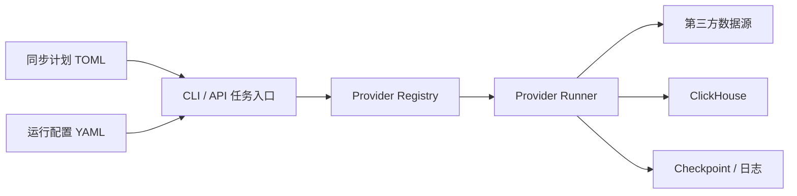

# AlphaBlocksSyncData

> AlphaBlocks 的同步数据项目，用于把多家金融数据提供商的数据按统一计划同步到 ClickHouse，并为 AlphaBlocks 后续的数据分析、策略研究和服务接口提供稳定的数据底座。

AlphaBlocksSyncData 把数据同步拆成三层：统一同步框架、独立 provider 实现、可配置的同步计划。项目当前已经接入 `AmazingData`、`BaoStock`、`QMT` 和免费美股数据源 `yfinance + FinanceDatabase`，可以通过 CLI 直接执行同步，也可以通过 API 服务触发后台任务。

---

## 项目定位

| 模块 | 说明 |
| --- | --- |
| 数据来源 | AmazingData、BaoStock、QMT、yfinance、FinanceDatabase |
| 数据落地 | ClickHouse |
| 执行方式 | CLI 命令、FastAPI 后台任务 |
| 配置方式 | Runtime YAML + Sync Plan TOML |
| 同步能力 | 全量同步、增量同步、checkpoint、任务日志 |
| 运行平台 | Linux / Windows 优先 |

## 核心能力

- 多 provider 分层：每个数据源都有独立目录、声明文件、同步入口和计划模板。
- 配置驱动同步：同步任务由 TOML 描述，运行参数由 YAML 管理。
- 增量更新：同步状态和 checkpoint 统一记录，避免重复拉取历史数据。
- 统一日志：CLI 和 API 任务共用同步日志能力，方便排查任务执行情况。
- API 调度：可以通过服务接口查看 provider、任务、配置，并触发同步任务。
- 配置校验：内置 provider、同步计划、运行配置和依赖检查脚本。

## 已接入 Provider

| Provider | 目录 | 主要用途 | 说明 |
| --- | --- | --- | --- |
| AmazingData | `providers/amazingdata/` | 主行情、基础信息、指数、ETF、可转债、期权、龙虎榜、融资融券、分红配股等 | 真实同步建议在 Linux / Windows 执行 |
| BaoStock | `providers/baostock/` | 交易日、股票基础信息、日线行情等公开数据 | 适合补充基础公开数据 |
| QMT | `providers/qmt/` | 通过 HTTP API 获取 QMT K 线数据 | 需要配置 QMT 服务地址和 API Key |
| US Market Free | `providers/yfinance/` | 美股证券主表、日线、公司行动、行业、板块和概念 ETF | 无 API Key；行情来自 yfinance，主数据来自 FinanceDatabase |

## 同步链路



## 运行环境

推荐环境：

- Linux 或 Windows
- Python 3.10+
- ClickHouse

平台说明：

- AmazingData 官方 SDK 在 macOS 环境下不可用或不稳定，AmazingData 真实同步建议在 Linux / Windows 上执行。
- BaoStock 和 QMT 的部分开发、配置校验、单元测试可以在 macOS 上执行。
- yfinance Provider 可在 macOS / Linux / Windows 运行，不依赖 AKShare。
- `config/runtime.local.yaml` 用于本地真实运行配置，示例文件是 `config/runtime.example.yaml`。

## 快速开始

```bash
git clone <your-repo-url>
cd AlphaBlocksSyncData

python3 -m venv .venv
source .venv/bin/activate
pip install -r requirements.txt

cp config/runtime.example.yaml config/runtime.local.yaml
```

编辑 `config/runtime.local.yaml`，填写 ClickHouse 和 provider 的真实连接信息。

## 配置文件

| 文件 | 作用 |
| --- | --- |
| `config/runtime.example.yaml` | 运行配置示例 |
| `config/runtime.local.yaml` | 本地真实运行配置 |
| `config/sync/plans/run_sync.amazingdata.full.toml` | AmazingData 全量同步计划 |
| `config/sync/plans/run_sync.baostock.daily.toml` | BaoStock 日常同步计划 |
| `config/sync/plans/run_sync.baostock.full.toml` | BaoStock 全量同步计划 |
| `config/sync/plans/run_sync.qmt.sample.toml` | QMT 同步计划示例 |
| `providers/yfinance/plans/full.toml` | 免费美股首次全量同步计划 |
| `providers/yfinance/plans/daily.toml` | 免费美股日常增量同步计划 |
| `providers/<name>/provider.toml` | provider 声明、依赖、任务和入口 |
| `providers/<name>/plans/*.toml` | provider 自带计划模板 |

运行配置中的常用字段：

```yaml
datasource:
  host: 127.0.0.1
  port: 8123
  database: default
  username: default
  password: ""

sync:
  amazingdata:
    username: YOUR_USERNAME
    password: YOUR_PASSWORD
    host: YOUR_HOST
    port: 0
    local_path: /path/to/amazingdata
  qmt:
    base_url: http://YOUR_QMT_HOST:8000
    api_key: YOUR_QMT_API_KEY
  yfinance:
    batch_size: 100
    default_start_date: "2010-01-01"
    include_otc: false
```

## 配置检查

```bash
python3 scripts/validate_provider.py --load-entrypoints
python3 scripts/validate_sync_config.py
python3 scripts/validate_runtime_config.py config/runtime.example.yaml --all --allow-placeholders
python3 scripts/install_provider_deps.py --all --check
```

如果依赖检查提示 `import AmazingData` 缺失，需要把 AmazingData 官方 SDK 安装到当前 Python 环境。

## 执行同步

按同步计划执行：

```bash
python3 scripts/run_provider_sync.py --config config/sync/plans/run_sync.qmt.sample.toml
python3 scripts/run_provider_sync.py --config config/sync/plans/run_sync.baostock.daily.toml
python3 scripts/run_provider_sync.py --config config/sync/plans/run_sync.amazingdata.full.toml
python3 scripts/run_provider_sync.py --config providers/yfinance/plans/full.toml
```

执行单个任务：

```bash
python3 scripts/run_provider_sync.py qmt.kline_history --codes 600000.SH --begin-date 20240101 --end-date 20240131 --period 1d
python3 scripts/run_provider_sync.py baostock.trade_dates --begin-date 20240102 --end-date 20240103
python3 scripts/run_provider_sync.py amazingdata.stock_basic --codes 600000.SH --limit 1
python3 scripts/run_provider_sync.py yfinance.daily_kline --codes AAPL,MSFT --begin-date 20240101
```

QMT 配置 dry-run：

```bash
python3 scripts/test_qmt_toml.py --dry-run config/sync/plans/run_sync.qmt.sample.toml
```

## API 服务

启动服务：

```bash
python3 scripts/run_api_service.py --host 127.0.0.1 --port 18080
```

常用接口：

```bash
curl http://127.0.0.1:18080/health
curl http://127.0.0.1:18080/api/sync/meta/providers
curl http://127.0.0.1:18080/api/sync/meta/tasks
curl http://127.0.0.1:18080/api/sync/meta/configs
```

## 目录结构

```text
AlphaBlocksSyncData/
├── core/                  # provider 注册、配置校验、执行分发
├── providers/             # AmazingData / BaoStock / QMT / yfinance provider 实现
├── config/
│   ├── runtime.example.yaml
│   └── sync/plans/        # 同步计划
├── scripts/               # CLI、校验和服务启动脚本
├── service/               # FastAPI 服务和任务管理
├── sync_core/             # 增量、日志、ClickHouse 公共能力
├── docs/                  # 中文文档
└── tests/                 # 单元测试
```

## Provider 分层

每个 provider 都按同一结构组织：

```text
providers/<name>/
├── provider.toml          # provider 元信息、依赖、任务声明
├── runner.py              # 同步任务入口
├── provider.py            # 数据源客户端或适配逻辑
├── repository.py          # ClickHouse 写入逻辑
├── specs.py               # 字段、表结构或任务规格
└── plans/                 # 同步计划模板
```

这种结构让不同数据源的实现彼此隔离，同时复用统一的同步状态、日志、配置解析和任务调度能力。

## 文档

| 文档 | 内容 |
| --- | --- |
| [运行手册](RUNBOOK.md) | 常用同步命令、任务说明、排查方式 |
| [API 服务文档](API_SERVICE.md) | API 启动和接口说明 |
| [BaoStock 说明](BAOSTOCK_RUNBOOK.md) | BaoStock 同步任务说明 |
| [QMT 接入说明](docs/qmt-data.md) | QMT HTTP API 和 TOML 测试说明 |
| [免费美股数据说明](docs/yfinance-data.md) | yfinance / FinanceDatabase 任务、表和使用边界 |
| [Provider 开发文档](docs/provider-development.md) | provider 目录、声明文件和任务配置说明 |

## License

MIT License
